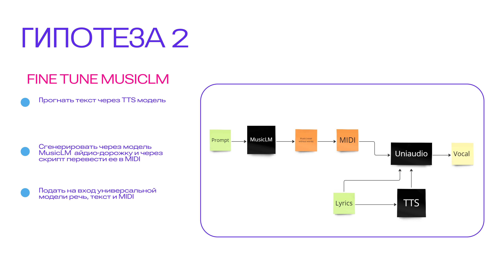

# Abstergo

- [Data pipeline](#data-pipeline)
- [ML pipeline](#ml-pipeline)

## Data pipeline

- спользовать открытые [библиотеки](https://github.com/MarshalX/yandex-music-api) парсинга музыкальных данных для
  сбора плейлистов с Яндекс.Музыки и обработать текстов и аудио дорожек песен
- Использовать доступные LLM для расширении названий плейлистов для генерации набора prompt’ов
- Извлекать аудио-дорожку с вокалом с помощью [demucs](https://github.com/facebookresearch/demucs)

## ML pipeline

Используем обученную модель MusicLm для fine-tuning на собранных плейлистах. Для того, чтобы сохранить целостность
произношения слов
внедряем в pipeline обученную TTS модель для генерации аудио-дорожку, которую будут обработать дополнительный слой
[MuLan](https://arxiv.org/abs/2208.12415). 

Гипотеза 2 

Генерация отдельно музыки по промту, отдельно миди-файла
Генерация аудио по тексту
Вместе с музыкой это все подается на вход некоторой LLM-based модели, например uniaudioи дообучается на этом 

### Обучающие данные для обновленной Musiclm модели:
input: 
- `prompt` - результаты обработки названии и метаданных песени 
- `synth_audio` - аудио-дорожка с генерированной речью
output:
- `vocal` - аудио-дорожка с вокалом
